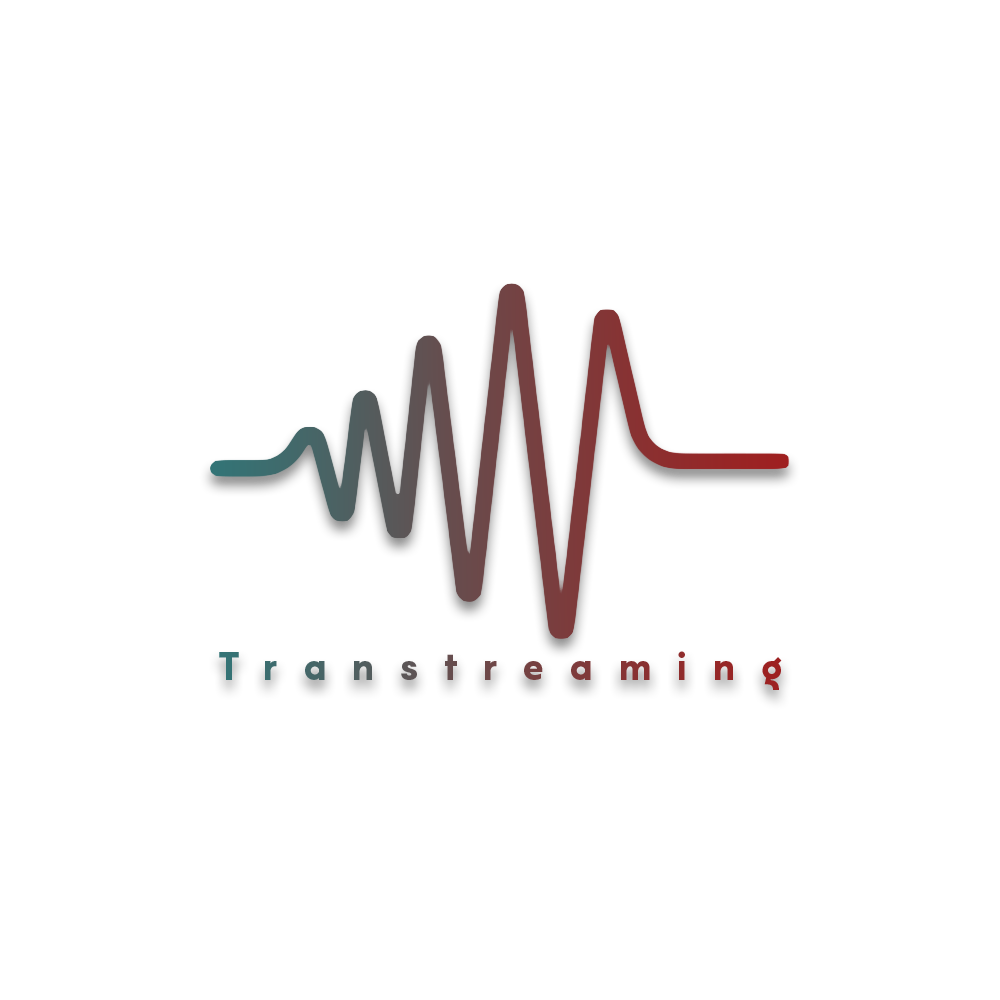

<!-- PROJECT LOGO -->
 

  

  <h3 align="center">Transtreaming</h3>

  

     
    <a href="https://github.com/othneildrew/Best-README-Template"><strong>Jupiter docs »</strong></a>
    <a href="https://github.com/othneildrew/Best-README-Template"><strong>Europa docs »</strong></a>
     
     
    <a href="https://transtreaming-jupyter.herokuapp.com">View Demo</a>
  

<!-- TABLE OF CONTENTS -->
## Table of Contents

* [About the Project](#about-the-project)
 * [Application Architecture](#application-architecture)
 
<!-- ABOUT THE PROJECT -->
## About The Project

Treamstreaming is a video calling application which helps two different people from different regions to communicate easily without any difficulty. It transcribe and translate the partner voice in a realtime. And agora give the power on realtime communication.

<!-- APPLICATION ARCHITECTURE -->
## Application Architecture
Application is divided into three major components.
  - Jupiter
  - Europa
  - Agora

[![Tramstreaming Architecture Diagram][architecture-diagram]](https://transtreaming-jupyter.herokuapp.com)
  
### Jupiter
Jupiter is the front end part of this application, it is created on reactjs. Which communicate directly with agora for a realtime calling video calling feature. It also transcribe the data and send it back to Europa through socket connection.
- [Github Repository](https://github.com/zilehuda/transtreaming-jupyter)

### Europa
Europa is the back end of this application, it is created on Flask. It translate the text send emit the data to the jupiter.
- [Github Repository](https://github.com/zilehuda/transtreaming-europa)

<!-- APPLICATION ARCHITECTURE -->
## Project Naming Convention
Project naming convention is based on the planet **Jupiter** echo system. We named our main application as **Jupiter** the front part of the transtreaming. And **Europa** is the moon of **Jupiter** which is the backend part of the transtreaming.

### Todos
 - Write MORE Tests
 - Add Night Mode

License
----

MIT

**Free Software, Hell Yeah!**

<!-- MARKDOWN LINKS & IMAGES -->
<!-- https://www.markdownguide.org/basic-syntax/#reference-style-links -->
[architecture-diagram]: documentation/architecture-diagram.png
